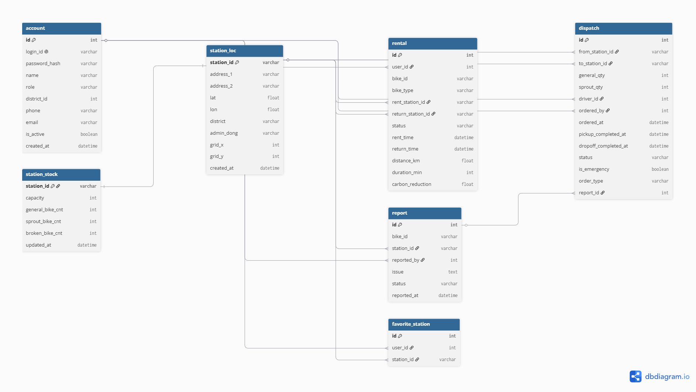
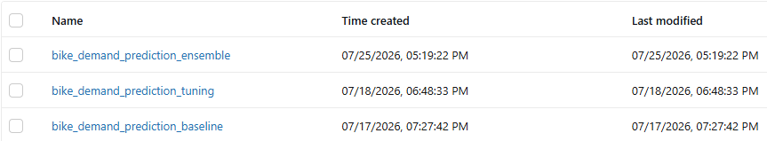

# 🚲 서울시 따릉이 대여 수요 예측 및 재배치 운영 지원 시스템

> **서울시 공공자전거(따릉이)의 수요를 AI로 예측하고, 관리자·배송 기사·사용자를 위한 맞춤형 웹 대시보드와 최적의 재배치(Dispatch) 운영을 지원하는 풀스택 웹 서비스**

🔗 **배포 주소**: [https://web-production-xxxx.up.railway.app](https://web-production-xxxx.up.railway.app) 
📊 **API 문서(Swagger)**: [/docs](http://localhost:8000/docs)

<!-- 대표 이미지 1장 (메인 화면 스크린샷) 넣으면 좋습니다 -->
<!--  -->

---

## 📌 프로젝트 소개

### 왜 만들었나
서울시 공공자전거 '따릉이'는 시민들의 발이 되어주고 있지만, 출퇴근 시간이나 주말 등 특정 시간대에 **"빌릴 자전거가 없거나(만성 고갈), 반납할 거치대가 없는(과포화)"** 불균형 문제가 지속적으로 발생하고 있습니다.

단순히 과거 데이터를 보여주는 것을 넘어, 머신러닝(ML)을 통해 **대여소별 미래 수요를 예측**하고, 이를 바탕으로 관리자와 배송 기사가 가장 효율적으로 자전거를 재배치(Dispatch)할 수 있도록 돕는 **종합 운영 지원 시스템**을 구축했습니다.

### 한 줄 요약
`사용자 이용 데이터 → ML 기반 시간대별 수요 예측 → 고갈/과포화 탐지 → 배송 기사 최적 경로 안내 및 재배치 지시`

---

## ✨ 주요 기능

이 서비스는 단일 사용자가 아닌 **관리자(Admin), 배송 기사(Driver), 일반 사용자(User)** 세 가지 역할을 위한 맞춤형 기능을 제공합니다.

| 대상 | 주요 기능 | 상세 설명 |
| :--- | :--- | :--- |
| **🤖 AI/ML** | **수요 예측 & 자동화** | MLflow 챔피언 모델을 통한 실시간/시간대별 대여 수요 예측<br>주기적인 외부 데이터(기상, 인구 등) 수집 및 예측 갱신 스케줄링 |
| **🏢 관리자** | **모니터링 & 디스패치** | 전체 대여소 현황 분석 및 통계 대시보드 제공<br>예측 기반의 만성 고갈/과포화 대여소 탐지 및 재배치 지시 |
| **🚚 기사** | **최적 경로 안내** | 배송 기사용 실시간 지도 제공<br>재배치 업무 효율을 위한 최적 이동 경로 안내 |
| **📱 사용자** | **대여 및 내역 조회** | 자전거 대여 기능 (QR코드 스캔 등)<br>개인 이용 내역 대시보드 |

---
## 👥 팀원 소개

| 이름  | 역할    | 담당 업무 | GitHub                              |
|:----|:------| :--- |:------------------------------------|
| 장수연 | 팀장    | | https://github.com/syeonris72       |
| 박은비 | 부팀장   | | https://github.com/eunbipark0223-max                                    |
| 김세호 | 팀원    | | https://github.com/ccanna95168-hash |
| 권덕윤 | 팀원    | | https://github.com/dukyoon13        |
| 전지혜 | 팀원    | | [@아이디](https://github.com/아이디)      |

---

## 🛠️ 기술 스택

**Backend**
- FastAPI + Uvicorn — REST API 서버
- Pydantic — 데이터 검증
- SQLAlchemy + Alembic — ORM / DB 마이그레이션
- MySQL (PyMySQL) — 관계형 데이터베이스
- JWT (PyJWT) + pwdlib(argon2) — 인증/보안
- APScheduler — 실시간 데이터 수집·예측 갱신 스케줄링

**Machine Learning / MLOps**
- scikit-learn, XGBoost, LightGBM — 수요예측 모델
- Optuna — 하이퍼파라미터 튜닝
- MLflow — 실험 관리 및 Champion 모델 서빙
- pandas, numpy, scipy, geopandas — 데이터 전처리/분석

**Data Collection (외부 Open API 연동)**
- 서울 열린데이터광장 (Open API) — 대여소 정보, 대여이력, 실시간 자전거 현황, 인프라(공원/대학/지하철) 데이터
- 기상청 API허브(KMA) — 기온·미세먼지(PM10) 등 기상 데이터
- 공공데이터포털(data.go.kr) — 실시간 초단기예보, 대기오염 측정 데이터
- BeautifulSoup4, requests — 크롤링/API 호출
- holidays — 공휴일 피처

**Frontend**
- Vanilla JS / HTML / CSS
- Bootstrap 5.3.3 + Bootstrap Icons — UI 컴포넌트
- Pretendard — 웹폰트
- Chart.js (+ chartjs-chart-sankey) — 데이터 시각화 (관리자 분석 대시보드)
- Kakao Map API — 대여소/배차 지도 시각화
- html5-qrcode — QR코드 스캔 (자전거 대여/반납)

**Infra**
- Supabase Storage — MLflow 아티팩트 저장소 (S3 호환)
- boto3 — Supabase Storage 연동 클라이언트

---

## 🏗️ 시스템 아키텍처

```text
┌────────────────┐      HTTP       ┌────────────────────────┐
│  사용자 / 기사 │ ───────────▶  │      FastAPI 서버      │
│ (웹 브라우저)  │ ◀───────────  │    (REST API & 라우터) │
└────────────────┘    JSON       └────────────────────────┘
                                     │                │
                        ┌────────────┘                └─────────────┐
                        ▼                                           ▼
              ┌───────────────────┐                       ┌────────────────────┐
              │     MySQL DB      │                       │ ML 추론 (serving/) │
              │ (회원, 대여소, 이력) │                       │ (로컬 pkl / MLflow)│
              └───────────────────┘                       └────────────────────┘
                        ▲                                           ▲
                        │                                           │
                        └───────────────────────────────────────────┘
                                데이터 수집 및 스케줄러 (APScheduler)
                                (기상청, 서울 열린데이터광장 API 연동)
```

**전체 흐름**
1. 사용자가 대여소를 조회하거나 관리자가 디스패치 화면에 접속
2. 프론트엔드가 /predict API 호출
3. FastAPI가 DB를 조회하여 실시간 피처(기상·인구·인프라 등) 계산
4. ML 모델이 해당 대여소의 시간대별 대여/반납 수요 예측
5. 고갈 및 과포화 여부 계산 후 응답 → 대시보드 및 지도 화면 표시
6. 배송 기사가 최적 경로로 자전거 재배치(Dispatch) 완료 시 DB 상태 업데이트

---
## 🗄️ DB ERD (Entity-Relationship Diagram)



**주요 핵심 테이블**

| 테이블 | 설명 | 주요 컬럼 |
| :--- | :--- | :--- |
| `account` | 회원 (관리자/기사/사용자)[cite: 5] | `id`, `login_id`, `role`, `district_id`, `created_at`[cite: 5] |
| `station_loc` | 대여소 기본 정보[cite: 5] | `station_id`, `address_1`, `lat`, `lon`, `district`[cite: 5] |
| `station_stock` | 실시간 자전거 재고 관리[cite: 5] | `station_id`(FK), `general_bike_cnt`, `sprout_bike_cnt`, `broken_bike_cnt`[cite: 5] |
| `rental` | 자전거 대여/반납 이력[cite: 5] | `id`, `user_id`(FK), `bike_id`, `rent_station_id`, `return_station_id`, `status`[cite: 5] |
| `dispatch` | 재배치(디스패치) 지시 내역[cite: 5] | `id`, `from_station_id`, `to_station_id`, `driver_id`, `status`, `order_type`[cite: 5] |
| `report` | 고장/이슈 신고 내역[cite: 5] | `id`, `bike_id`, `station_id`(FK), `reported_by`, `status`[cite: 5] |
| `demand_prediction_master_2024` | ML 수요 예측용 마스터 데이터[cite: 5] | `datetime_hr`, `station_id`, `general_rent_cnt`, `temperature`, `flwpop_tot` 등[cite: 5] |

**주요 테이블 관계 (Relationships)**
- `account` **1 : N** `rental` (한 사용자가 여러 번 대여 가능)[cite: 5]
- `account` **1 : N** `dispatch` (관리자가 지시하고, 특정 기사가 여러 배치 업무를 수행)[cite: 5]
- `station_loc` **1 : 1** `station_stock` (각 대여소는 하나의 실시간 재고 상태를 가짐)[cite: 5]
- `station_loc` **1 : N** `rental` (한 대여소에서 여러 번의 대여/반납 발생)[cite: 5]
- `station_loc` **1 : N** `dispatch` (한 대여소가 재배치의 출발지 또는 도착지가 됨)[cite: 5]

---
## 📡 API 문서

> FastAPI가 자동 생성하는 Swagger 문서: **`/docs`** 에서 전체 확인 가능
### 주요 엔드포인트

**인증 및 권한 (`auth.py`)**
| 메서드 | 경로 | 설명 |
| :--- | :--- | :--- |
| <!-- 내용 추가 예정 --> | | |

**대여소 및 기본 정보 (`station.py`)**
| 메서드 | 경로 | 설명 |
| :--- | :--- | :--- |
| <!-- 내용 추가 예정 --> | | |

**AI 수요 예측 (`predict.py`)**
| 메서드 | 경로 | 설명 |
| :--- | :--- | :--- |
| <!-- 내용 추가 예정 --> | | |

**일반 사용자 전용 (`user.py`)**
| 메서드 | 경로 | 설명 |
| :--- | :--- | :--- |
| <!-- 내용 추가 예정 --> | | |

**배송 기사 전용 (`driver.py`)**
| 메서드 | 경로 | 설명 |
| :--- | :--- | :--- |
| <!-- 내용 추가 예정 --> | | |

**관리자 대시보드 및 통계 (`admin.py`, `analytics.py`)**
| 메서드 | 경로 | 설명 |
| :--- | :--- | :--- |
| <!-- 내용 추가 예정 --> | | |

---
## 🤖 ML 학습 파트 및 데이터 파이프라인

이 프로젝트의 핵심 — **시간대별 대여소 수요 예측 모델 및 최적화 파이프라인**

### 전체 학습 로직

<!-- 이미지 다이어그램으로 교체하면 더 좋습니다:  -->

```text
① 모듈화 데이터 수집        ② 순차적 정제 및 병합      ③ 피처 엔지니어링 & 최적화
┌─────────────────┐      ┌─────────────────────┐    ┌───────────────────────┐
│ 기상청, 공공데이터 │ ───▶ │ 중간 병합 단계마다    │──▶ │ 도메인 파생 변수 생성  │
│ 서울 열린데이터광장 │ API  │ 결측치/이상치 즉시 제거│    │ & Memory Downcasting │
└─────────────────┘      └─────────────────────┘    └───────────────────────┘
                                                        │ (통합 중요도 기반 노이즈 제거)
        ┌───────────────────────────────────────────────┘
        ▼
④ 데이터 분할 (시계열)       ⑤ 여러 모델 학습 및 튜닝 (MLflow / Optuna)
┌──────────────────┐          ┌─────────────────────────┐
│ 시간순 정렬 후     │          │ LightGBM, XGBoost 등    │
│ train / test 분할  │  ───────▶│ Optuna로 하이퍼파라미터  │
│ (미래 참조 누수 방지)│          │ 탐색 및 MLflow 기록      │
└──────────────────┘          └─────────────────────────┘
                                          │
                                          ▼
                               ⑥ 시계열 맞춤형 커스텀 앙상블
                               ┌──────────────────────────┐
                               │ 수동 OOF Stacking 적용    │
                               │ (TimeSeriesSplit 직접 순회)│
                               └──────────────────────────┘
                                          │
                                          ▼
                               ⑦ 최종 챔피언 모델 선정 및 저장
                               ┌───────────────────────────┐
                               │ 타깃별 최고 성능 모델 선정 │
                               │ → Supabase(S3) 아티팩트 저장│
                               └───────────────────────────┘
                                          │
                                          ▼
                               ⑧ 서버(serving)가 동적 로드
                                  → /predict 요청마다 실시간 추론
```

### 무엇을 예측하나
특정 날짜/시간과 대여소를 입력하면 **일반 자전거 / 새싹 자전거의 대여량과 반납량**을 각각 예측하고, 이를 바탕으로 해당 대여소의 과포화 및 고갈 여부를 판별합니다.

### 데이터 및 전처리 파이프라인

**1. 방대한 다중 도메인 데이터 수집 (Data Sources)**
총 14종 이상의 외부 공공 API 및 오픈 데이터를 직접 수집하여, 자전거 수요에 영향을 미치는 다차원적인 분석 기반(환경, 인구, 지리적 요인)을 구축했습니다.

*   **🚲 따릉이 데이터**
    *   [따릉이 대여 및 반납 이력 데이터](https://data.seoul.go.kr/dataList/OA-15182/F/1/datasetView.do)
    *   [대여 위치 정보 데이터](https://data.seoul.go.kr/dataList/OA-21235/S/1/datasetView.do)
    *   [실시간 따릉이 대여 및 거치 정보 데이터](https://data.seoul.go.kr/dataList/OA-15493/A/1/datasetView.do)
*   **🌤️ 환경 및 기상 데이터**
    *   [실시간 미세먼지 데이터](https://data.seoul.go.kr/dataList/OA-1200/S/1/datasetView.do) / [시간별 미세먼지 데이터](https://data.kma.go.kr/data/climate/selectDustRltmList.do?pgmNo=68)
    *   [실시간 기상 데이터(1)](https://www.airkorea.or.kr/web/), [(2)](https://data.kma.go.kr/data/grnd/selectAsosRltmList.do) / [시간별 기상 데이터](https://apihub.kma.go.kr/)
*   **👥 인구 데이터**
    *   [유동 인구 데이터](https://data.seoul.go.kr/dataList/OA-22179/S/1/datasetView.do)
    *   [생활 인구 데이터](https://data.seoul.go.kr/dataList/OA-15439/S/1/datasetView.do)
*   **🏢 인프라 데이터**
    *   [공원 위치 데이터](https://data.seoul.go.kr/dataList/OA-394/S/1/datasetView.do) / 하천 위치 데이터 [(1)](https://www.vworld.kr/dtmk/dtmk_ntads_s002.do?dsId=30603), [(2)](https://www.vworld.kr/dtmk/dtmk_ntads_s002.do?dsId=30207)
    *   [학교(초, 중, 고) 위치 데이터](https://www.data.go.kr/data/15152021/fileData.do#tab-layer-openapi) / [대학교 위치 데이터](https://data.seoul.go.kr/dataList/OA-12974/S/1/datasetView.do)
    *   [직장 위치 데이터](https://data.seoul.go.kr/dataList/OA-22243/F/1/datasetView.do) / [지하철 역 출입구 위치 데이터](https://data.seoul.go.kr/dataList/OA-21232/S/1/datasetView.do?tab=A)

**2. 데이터 전처리 최적화 (Data Preprocessing)**
- **메모리 최적화**: 440만 건의 대여 이력을 `chunksize`로 분할 로드하고, 데이터 손실 없이 64-bit 자료형을 32-bit로 변환(Downcasting)하여 OOM(Memory Error)을 방지했습니다.
- **순차적 무결성 확보**: 모든 데이터를 한 번에 병합 후 결측치를 처리하지 않고, **개별 파일 및 중간 데이터 병합 단계마다 순차적으로 이상치와 결측치를 즉시 제거**하여 데이터 파이프라인의 신뢰성을 극대화했습니다.
### 피처 (Feature)
단순한 시계열 데이터를 넘어, 대여소 주변의 지리적 특성, 성별·연령별 이용 성향, 실시간 유동/생활 인구, 기상 악화 요인 등 **50여 개 이상의 다차원 피처**를 종합적으로 구축하여 학습에 활용했습니다.

**1. 대여 이력 및 인구통계학적 타깃/특성 (Rent History & Demographics)**

| 피처 그룹 | 세부 컬럼 및 설명 |
| :--- | :--- |
| **대여/반납 건수** | `general_rent_cnt`, `sprout_rent_cnt`, `general_rtn_cnt`, `sprout_rtn_cnt` (일반/새싹 자전거 대여·반납량) |
| **이용 시간** | `total_use_min`, `avg_use_min` (총 사용 시간 및 평균 사용 시간) |
| **성별 이용 성향** | `rent_male_cnt`, `rent_female_cnt`, `rent_gender_unk_cnt` (대여·반납별 성별 건수) |
| **연령대별 성향** | `rent_age_10_cnt` ~ `60_cnt`, `rtn_age_10_cnt` ~ `60_cnt` (10대 이하부터 60대 이상까지 세대별 대여·반납 패턴) |

**2. 지리적 인프라 및 공간 데이터 (Infra & Spatial)**

| 피처 그룹 | 세부 컬럼 및 설명 |
| :--- | :--- |
| **대중교통 & 시설** | `subway_cnt_300m`, `biz_cnt_300m`, `edu_cnt_500m`, `park_cnt_500m`, `river_cnt_1km` (반경 내 지하철, 직장, 학교, 공원, 하천 수) |
| **거리 지표** | `dist_subway`, `dist_river` (가장 가까운 지하철역 및 하천까지의 직선 거리) |
| **위치 정보** | `district` (자치구), `lat`, `lon` (위경도 좌표) |

**3. 환경 및 기상 데이터 (Weather & Environment)**

| 피처 그룹 | 세부 컬럼 및 설명 |
| :--- | :--- |
| **기상 요인** | `temperature` (기온), `precipitation` (강수량), `snowfall` (적설량), `pm10` (미세먼지) |
| **시간 축** | `datetime_hr` (1시간 단위 기준 시간), `day_of_week` (요일), `is_weekend` (주말 여부), `is_holiday` (공휴일 여부) |

**4. 유동인구 및 생활인구 데이터 (Population Flow & Living)**

| 피처 그룹 | 세부 컬럼 및 설명 |
| :--- | :--- |
| **유동인구** | `flwpop_tot` 및 연령대별(`flwpop_10s` ~ `60up`) 시간대별 총 유동인구 |
| **생활인구** | `lvgpop_tot` 및 연령대별(`lvgpop_10s` ~ `60up`) 실제 체류 인구 데이터 |

**5. 도메인 특화 파생 변수 (Feature Engineering)**

| 피처명 | 설명 |
| :--- | :--- |
| `subway_last_mile_synergy` | 심야 시간대(23~01시) × 반경 300m 지하철역 수 (막차 귀가 수요 패턴 포착) |
| `pop_spike_ratio` | 하루 평균 유동인구 대비 특정 시간대 유동인구 비율 (일시적 인구 밀집 반영) |
| `population_dynamic_flux` | 특정 시간대와 1시간 전 생활인구의 차분값 (인구의 유입/유출 동적 흐름 반영) |

> 💡 **통합 피처 중요도(Unified Feature Importance) 기반 노이즈 제거**
> 50개가 넘는 방대한 변수로 인한 차원의 저주를 막기 위해, 8개 알고리즘의 중요도를 정규화 및 평균 내어 통합 중요도 0.01 미만의 하위 변수는 모델 성능을 저해하는 노이즈로 규정하고 과감히 소거했습니다.
### 평가지표 및 타깃 변환
자전거 수요 데이터는 편차가 극심하여(비 오는 날 0대, 주말 수천 대), 모델이 큰 값의 오차에만 과도하게 페널티를 받는 것을 막기 위해 타깃 스케일링을 적용했습니다.

| 지표 | 의미 | 특징 |
| :--- | :--- | :--- |
| **RMSLE** | 로그 변환 후 RMSE | 값의 범위가 넓을 때 **상대 오차**를 공평하게 평가 **(주 지표)** |
| **RMSE** | 평균 제곱근 오차 | 실제 대여/반납 대수 단위의 직관적인 절대 오차 크기 |
| **MAE** | 평균 절대 오차 | 이상치에 덜 민감한 평균 오차 |

> 💡 **타깃 변환 로직 적용 (`TransformedTargetRegressor`)**
> 학습 시 타깃 변수에 `np.log1p`를 씌워 정규분포화하고, 예측 후 `np.expm1`로 복원 시 음수 값이 나오지 않도록 하한선을 0으로 고정하는 커스텀 역변환 함수(`inverse_log_clip`)를 구현하여 적용했습니다.

### 모델 선정 (3단계)

**1단계 — Baseline: 앙상블 기준선 구축**
가장 널리 쓰이는 트리 기반 모델들을 묶어 기본적인 앙상블 기준선(Soft Voting)을 세우고 단일 모델과 비교했습니다. (`general_rent_cnt` 기준)

| 모델 | RMSLE | RMSE | MAE |
| :--- | :--- | :--- | :--- |
| RandomForest (단일) | 0.52536 | 3.167 | 1.823 |
| LightGBM (단일) | 0.51319 | 3.153 | 1.778 |
| XGBoost (단일) | 0.51257 | 3.113 | 1.769 |
| **Voting Regressor (Baseline)** | **0.50631** | **3.055** | **1.750** |

**2단계 — 하이퍼파라미터 튜닝 (Optuna)**
Baseline 구성 모델들을 Optuna로 튜닝하여 성능을 극대화했습니다.

| 모델 | 튜닝 전 RMSLE | 튜닝 후 RMSLE | 개선 |
| :--- | :--- | :--- | :--- |
| XGBoost | 0.51257 | 0.50504 | ▼ 0.00753 |
| LightGBM | 0.51319 | 0.50778 | ▼ 0.00540 |
| RandomForest | 0.52536 | 0.51667 | ▼ 0.00869 |

- 탐색한 주요 파라미터: `n_estimators`, `max_depth`, `learning_rate`, `min_samples_split` 등
- 탐색 횟수(trials): 각 모델별 최적화 트라이 진행

**🎛️ 주요 모델 최적 하이퍼파라미터 요약 (Best Params)**
Optuna를 통해 각 모델별 특성에 맞는 탐색 공간(Search Space)과 튜닝 목적(과적합 제어, 밸런스 등)을 설정하고, 수십 회의 Trials를 거쳐 도출된 최적의 튜닝 전략입니다.

| 모델 | 탐색한 주요 하이퍼파라미터 | 최적 성능을 낸 튜닝 전략 및 탐색 범위 |
| :--- | :--- | :--- |
| **XGBoost** | `n_estimators`, `max_depth`, `learning_rate` | **[학습 밸런스]** n_estimators: 200~500, max_depth: 8~11, lr: 0.005~0.05 |
| **LightGBM** | `n_estimators`, `max_depth`, `learning_rate` | **[과적합 방지]** n_estimators: 1000~5000, max_depth: 3~6, lr: 0.005~0.05 |
| **RandomForest** | `n_estimators`, `max_depth`, `max_features`, `min_samples_split` | **[단일 최적값]** n_estimators: 500, max_depth: 19, max_features: sqrt, min_samples_split: 3 |

**3단계 — 시계열 맞춤형 커스텀 스태킹 (Manual OOF Stacking)**
단순 Voting을 넘어 성능을 한계까지 끌어올리기 위해 Stacking 앙상블을 적용했습니다.

- **기존 라이브러리의 한계**: 일반 `StackingRegressor`를 시계열 분할(`TimeSeriesSplit`)과 결합 시 미래 데이터가 과거에 끼어드는 **데이터 누수(Leakage)** 발생.
- **해결책 (직접 구현)**: `TimeSeriesSplit` 폴드를 직접 순회하며 OOF(Out-Of-Fold) 예측을 수행하고 누수를 완벽히 차단하는 커스텀 클래스(`ManualStackingRegressor`)를 구현.
- **메타 모델**: Base 모델(LGBM, XGB)의 예측값을 바탕으로 `Ridge` 선형 회귀를 최종 추론 모델로 사용.

| 앙상블 방식 | 구성 모델 | RMSLE | RMSE | MAE |
| :--- | :--- | :--- | :--- | :--- |
| Custom Stacking | Base(LGBM, XGB) + Meta(Ridge) | **0.50337** | **2.970** | **1.721** |

### 최종 챔피언 모델 선정
- 4가지 타깃(일반 대여, 새싹 대여, 일반 반납, 새싹 반납)별로 **단일 모델, Voting, Custom Stacking 전체를 교차 비교하여 가장 우수한 모델을 각각 챔피언으로 선정**했습니다.
- 과적합을 철저히 검증하기 위해 파이프라인 전체에서 단 한 번도 쓰지 않은 **격리된 Test Set으로 딱 한 번만 최종 평가**를 수행했습니다.
---

### 📊 MLflow 및 Supabase 기반 MLOps 및 모델 관리

여러 모델과 파라미터를 실험하다 보면 **"어떤 설정에서 성능이 가장 좋았는지"** 기억하기 어렵습니다. 그래서 **MLflow**로 모든 실험을 자동 기록·비교하고, 대용량 모델 파일 공유 문제를 해결하기 위해 **Supabase**(**클라우드 스토리지**)를 연동했습니다.

**1. MLflow를 통한 실험 트래킹**
머신러닝 실험을 추적·관리하는 도구로, 모델을 학습할 때마다 어떤 파라미터로 학습했고 성능(지표)이 얼마였는지를 자동으로 기록해 최적 조합을 찾았습니다.
* **Parameters**: 모델 종류, 하이퍼파라미터 (`n_estimators`, `max_depth`, `learning_rate` 등)
* **Metrics**: RMSLE, RMSE, MAE 등 평가지표
* **실험 비교**: 여러 run을 나란히 비교해 최고 성능 조합 선택

**2. Supabase Storage (S3 호환) 연동 및 파이프라인 자동화**
* **대용량 파일 공유 해결**: 앙상블 완료 후 생성되는 무거운 모델 파일(`.pkl`)과 중요도 시각화 이미지는 Github에 올릴 수 없으므로, AWS S3 호환 프로토콜을 지원하는 **Supabase Storage**에 분리 저장했습니다.
* **동적 아티팩트 Sync**: 서버 실행 시 또는 학습 파이프라인 구동 시, Supabase에 저장된 최적 파라미터(`best_params.json`)와 모델 아티팩트를 `boto3`를 통해 동적으로 Fetch(다운로드)하여 팀원 간 로컬 환경 불일치와 휴먼 에러를 원천 차단했습니다.

**우리가 기록·관리한 항목 요약**

| 항목 | 내용 |
| :--- | :--- |
| **Parameters & Metrics** | Optuna 튜닝 결과 및 RMSLE/RMSE/MAE 지표 자동 기록 (MLflow) |
| **Artifacts Storage** | 직렬화된 챔피언 모델(.pkl) 및 시각화 리소스 (Supabase S3) |
| **Pipeline Automation** | 클라우드에 저장된 설정값 기반 모델 동적 로드 및 서빙 연동 |

**팀원별 실험 기록**
실제 MLflow 트래킹 데이터(`baseline.csv`, `tuning.csv`)에 기록된 팀원별 담당 업무와 실험 내용입니다.

| 팀원 | 담당 역할 및 실험 내용 | 주요 발견 및 기여 |
| :--- | :--- | :--- |
| **장수연** | LightGBM 모델 베이스라인 및 Optuna 하이퍼파라미터 튜닝 (`tuning(수연).ipynb`) | LightGBM의 트리 구조 및 학습률 최적화를 통해 단일 모델 최고 성능군 달성 |
| **박은비** | XGBoost 모델 베이스라인 및 Optuna 하이퍼파라미터 튜닝 (`XGBoost_tuning(은비).ipynb`) | XGBoost 최적 파라미터 탐색을 통해 Baseline 대비 오차 개선율 확보 |
| **김세호** | 선형 회귀 계열 모델 베이스라인/튜닝 및 Supabase-S3 클라우드 스토리지 아키텍처 연동 | 선형 모델 한계 분석, 시계열 누수 방지용 OOF Stacking 구현 및 Supabase 동적 파이프라인 구축 |
| **권덕윤** | RandomForest 모델 하이퍼파라미터 최적화 실험 (`tuning(덕윤).ipynb`) | 숲의 깊이(`max_depth`) 및 샘플 분할 조건 최적화 수행 |

**MLflow 실험 화면**

<!-- ▼▼▼ MLflow 실험 화면 캡처를 여기에 넣어주세요 ▼▼▼ -->

**① 실험 목록 (여러 run 비교 화면)**



**② 파라미터·지표 비교**

rmse 파라미터 지표


rmsle 파라미터 지표


rmsle 파라미터 지표


**③ 최고 성능 run 상세**

일반 따릉이 대여 최종 테스트


일반 따릉이 반납 최종 테스트


새싹 따릉이 대여 최종 테스트


새싹 따릉이 반납 최종 테스트


---
## 🖥️ 화면 구성

이 서비스는 **사용자(User), 관리자(Admin), 배송 기사(Driver)** 세 가지 역할에 맞춘 전용 대시보드와 UI를 제공합니다.

| 대상 | 화면 | 설명 |
| :--- | :--- | :--- |
| **📱 사용자** | **메인 (지도)** | 사용자 로그인 후 현재 위치 기반 주변 대여소 및 실시간 자전거 현황 확인 |
| | **대여 (QR 스캔)** | 카메라를 이용한 QR 코드 스캔 및 따릉이(일반/새싹) 대여 진행 |
| **🏢 관리자** | **관제 대시보드 (전체)** | 관리자 로그인 후 전체 대여소의 거치 현황을 한눈에 파악하는 지도 |
| | **대시보드 (과포화 필터링)** | 수용 한도를 초과하여 자전거가 과도하게 거치된 '과포화' 대여소 집중 모니터링 |
| | **대시보드 (고갈 필터링)** | 대여할 자전거가 없어 텅 빈 '고갈' 대여소를 파악하여 재배치 우선순위 파악 |
| **🚚 기사** | **지시서 관리** | 배송 기사에게 할당된 재배치(수거/배치) 및 고장 수거 업무 지시서 목록 확인 |
| | **경로 안내 (카카오내비)** | 지시서 수행 시 이동해야 할 최적 경로 확인 및 카카오내비 앱 연동을 통한 길 안내 |

<br>

### 📱 1. 사용자 화면 (User)
사용자 주변의 대여소를 확인하고 QR 코드로 손쉽게 자전거를 대여합니다.


### 🏢 2. 관리자 대시보드 (Admin)
전체 대여소의 현황을 파악하고, ML 예측을 기반으로 재배치가 시급한 과포화/고갈 대여소를 필터링합니다.


### 🚚 3. 배송 기사 화면 (Driver)
할당된 업무 지시서를 확인하고, 카카오내비 연동을 통해 효율적으로 자전거를 재배치합니다.


---

## 🚀 설치 및 실행

```bash
# 1. 저장소 복제
git clone [https://github.com/팀계정/seoul_bike.git](https://github.com/팀계정/seoul_bike.git)
cd seoul_bike

# 2. 가상환경 생성 및 활성화
python -m venv .venv
source .venv/bin/activate      # Windows: .venv\Scripts\activate

# 3. 패키지 설치
pip install -r requirements.txt

# 4. 환경변수 설정 (.env 파일 생성)
# DB_HOST, DB_PORT, DB_USER, DB_PASSWORD, DB_NAME
# JWT_SECRET_KEY, SUPABASE_URL, SUPABASE_KEY 등

# 5. 서버 실행
uvicorn main:app --reload
# → [http://127.0.0.1:8000](http://127.0.0.1:8000)
```

> 💡 ML 챔피언 모델(`.pkl`)은 서버 가동 시 Supabase S3 클라우드 스토리지에서 자동으로 Fetching 되므로 별도의 모델 파일 로컬 다운로드가 필요하지 않습니다.

---

## 🔧 트러블슈팅 (ML 학습 및 데이터 파이프라인)

- **데이터 정제 병목 현상과 메모리 초과 (OOM)**: 초기에는 모든 데이터를 하나로 병합한 후 마지막에 결측치와 이상치를 한 번에 처리하려 했으나, 메모리 초과와 에러 전파 문제가 발생했습니다. 이를 해결하기 위해 파이프라인을 수정하여, **각 개별 데이터 및 중간 병합 단계마다 순차적으로 이상치와 결측치를 즉시 제거**하도록 로직을 변경하여 데이터 무결성을 확보했습니다.
- **시계열 데이터 누수 (Data Leakage)**: 기본 StackingRegressor를 시계열 분할(TimeSeriesSplit)과 결합할 때, 미래의 데이터가 과거 폴드에 끼어드는 현상을 발견했습니다. 이를 완벽히 차단하기 위해 **직접 OOF(Out-Of-Fold)를 순회하며 검증하는 커스텀 클래스(`ManualStackingRegressor`)를 직접 구현**하여 모델의 실제 예측 신뢰도를 높였습니다.
- **예측값이 음수로 떨어지는 문제**: 회귀 모델 특성상 수요가 적은 시간대/대여소의 예측값이 음수로 도출되는 문제가 있었습니다. 학습 시 타깃에 `np.log1p`를 씌워 정규화하고, 추론 후 `np.expm1`로 복원할 때 **결과값을 0 이상의 하한선으로 고정(clamp)하는 커스텀 역변환 로직**을 적용했습니다.

---

## 🚀 배포 

<details>
<summary>배포 환경 및 설정 (접었다 펼치기)</summary>

- **서버 환경**: 
- **데이터베이스**: MySQL
- **모델 스토리지**: Supabase Storage
</details>

---

## 📝 프로젝트 소감

### 👤 장수연 (팀장)
- 

### 👤 박은비 (부팀장)
- 

### 👤 김세호 (팀원)
- 

### 👤 권덕윤 (팀원)
- 

### 👤 전지혜 (팀원)
- 

---

## 🔍 팀 전체 회고

**잘한 점**
- 

**아쉬운 점 / 개선하고 싶은 점**
- 

**다음 프로젝트에 적용할 것**
- 

---

## 📁 프로젝트 구조 (Project Structure)

```text
seoul_bike/
├── auth/                       # 인증 및 권한 처리 (deps, jwt 등)
│   ├── __init__.py, deps.py, jwt.py, password.py
├── database/                   # DB 연결 설정 및 ORM 로직
│   ├── __init__.py, db_connection.py, orm.py
├── ml/                         # 머신러닝 학습 파이프라인 (Jupyter Notebook)
│   ├── baseline.ipynb, ensemble.ipynb
├── models/                     # SQLAlchemy DB 테이블 모델
│   ├── __init__.py, models.py
├── routers/                    # FastAPI API 라우터 (엔드포인트)
│   ├── admin.py, analytics.py, auth.py, config.py, driver.py, predict.py, station.py, user.py
├── schema/                     # Pydantic 데이터 검증 스키마 (Request / Response)
│   ├── __init__.py, request.py, response.py
├── serving/                    # ML 모델 로드, 피처 엔지니어링 및 실시간 추론 로직
│   ├── analytics_utils.py, bike_split.py, constant.py, demand_prediction_forecast.py
│   ├── deps.py, district.py, env.py, env_history.py, feature.py, feature_group.py
│   ├── mapping.py, mlflow_model_load.py, mlflow_setup.py, rent_history.py
│   └── scheduler.py, station_lookup.py, station_stock.py, target_encoding.py
├── static/                     # 프론트엔드 정적 리소스 (바닐라 JS)
│   ├── css/                    # 역할별 스타일시트 (admin, driver, user 등)
│   ├── img/                    # 로고, 아이콘 및 메인 비주얼 이미지
│   ├── js/                     # 클라이언트 로직, API 연동 및 지도(Kakao Map) 렌더링
│   │   ├── api.js, kakao-map.js, admin-*.js, driver-*.js, user-*.js 등
│   └── *.html                  # 역할별 대시보드 및 화면 (index, admin, driver, user 등)
├── main.py                     # FastAPI 애플리케이션 진입점 (실행 파일)
├── requirements.txt            # 프로젝트 패키지 의존성 명세
├── .gitignore                  # Git 추적 제외 파일 목록
└── README.md                   # 프로젝트 소개 문서
```

> ⚠️ `.env` (보안 키), `models_pkl/` (대용량 모델 파일), `data/` (원본 데이터) 등은 보안 및 용량 문제로 GitHub에 업로드하지 않고 서버 및 클라우드(Supabase) 환경에서 개별 관리합니다.
