# 🚲 서울시 따릉이 데이터 분석 및 대여소 배치 예측 웹사이트


> **서울시 공공자전거 따릉이의 수요 예측 및 관리자·기사·일반 회원 맞춤형 대시보드와 재배치 최적화 운영 지원 서비스**

* **배포 주소**: [https://web-production-xxxx.up.railway.app](https://web-production-xxxx.up.railway.app)
* **API 문서(Swagger)**: [/docs](http://localhost:8000/docs)

---
# 프로젝트 개요

## 1️⃣  분석 기획

### 주제 선정 배경
**서울시 공공자전거 따릉이** 이용량이 증가하면서 대여소 간 수급 불균형 문제가 발생하고 있음

⇒ 특정 시간대, 지역에서 반복되는 따릉이 고갈 또는 과포화 현상 해소 필요

⇒ 머신러닝(ML) 기반 **대여소별 미래 수요 예측** 및 효율적인 자전거 재배치를 위한 웹사이트 구축

### 분석 범위 설정
- **분석 대상 데이터**: 2024년 따릉이 대여 및 반납 이력 데이터 약 2,820만 행
- **지역 범위**: 집중 분석을 위해 서울시 따릉이 대여 건수가 가장 많은 자치구 두 곳과 상업지구와 생활지구의 극명한 차이를 볼 수 있는 두 곳 선정 — 마포구, 강서구(마곡지구), 송파구, 영등포구(여의도)
- **이용권 정제**: 따릉이 대여 이용권의 종류가 다양한 점 고려 ⇒ 이용 패턴 최적화를 위해 1인 이용권 중심으로 데이터 정제

### 분석 전략
2024년 따릉이 대여 및 반납 이력 데이터와 환경, 인구, 인프라 등 여러 외부 요인 데이터 결합

⇒ 시간대별 수요 예측 머신러닝 모델 학습 및 최적화

⇒ 실시간 데이터 기반 대여소별 수요 예측 및 재배치 최적화

## 2️⃣ 주요 기능

AI/ML 파이프라인은 MLflow 챔피언 모델을 통해 실시간·시간대별 대여 수요를 예측하고, 기상·인구 등 외부 데이터를 주기적으로 수집해 예측을 갱신. 이를 기반으로 **일반 회원, 기사, 관리자** 세 가지 역할별 화면과 공통 헤더 기능 제공

### 👤 일반 회원

> **대여소 지도**
- 대여소 위치 및 현황 파악 (핀맵과 목록, 거리순/여유순 정렬)
- 대여소 검색
- 따릉이 대여 및 반납 (카메라 QR 스캔 또는 수동 입력)
- 고장 신고 (카메라 QR 스캔 또는 수동 입력)
- 대여소 즐겨찾기

> **대여 · 반납 이력**
- 연/월별 대여 및 반납 이력 상세 조회
- 탄소 저감량 시각화

### 🚚 기사

> **지시서 목록**
- 본인에게 배정된 지시서 조회
- 작업 처리 및 업무 수행 (카메라 QR 스캔 또는 수동 입력)

> **경로 지도**
- 수거 및 배치 위치, 고장 따릉이 수거 대여소 지도 시각화
- 마커 클릭 시 카카오내비 길 안내 연동

### 🧑‍💻 관리자

> **관제 지도**
- 자치구 및 행정동 상세 필터
- 전체 대여소 현황 목록
- 마커 클릭 시 해당 대여소 지시서 작성

> **지시서 관리**
- 지시서 상태별 조회
- AI 추천 기반 지시서 일괄 발송
- 수동 지시서 작성 및 기사 지정

> **고장 신고 관리**
- 지시서 상태별 조회
- 다중 신고 내역을 하나로 변환 후 발송

> **데이터 분석**
- 자치구 상세 필터
- Sankey, 콤보, 히트맵 등 데이터 시각화

### 🚩 공통 헤더
- 날씨 요약 팝업 (현 시각 날씨와 1시간 전 날씨 비교)
- 실시간 맞춤 알림
- 프로필, 설정, 로그아웃

## 3️⃣  팀원 및 역할

| 이름 | 역할 | 담당 업무 | GitHub |
|:---|:---|:---|:---|
| **장수연** | PM | <ul><li>전체 총괄 및 일정 관리</li><li>GitHub 형상 관리</li><li>ORM 데이터베이스 설계</li><li>데이터 수집/전처리</li><li>ML 베이스라인 구축</li><li>하이퍼파라미터 튜닝</li><li>앙상블 모델링</li><li>백엔드 전체 구축(FastAPI)</li><li>Kakao Maps API 연동</li><li>ML 모델 서빙</li><li>UI/UX 디자인 및 구현</li><li>프론트엔드-백엔드 연동</li><li>전체 시스템 통합 및 배포</li></ul> | https://github.com/syeonris72 |
| **박은비** | Deputy PM | <ul><li>PM 부재 시 팀 리딩 및 일정 관리 지원</li><li>인프라 데이터 수집/전처리</li><li>하천/공원 공간 데이터 전처리</li><li>인프라 데이터 통합</li><li>ML 베이스라인 구축 지원</li><li>피처 엔지니어링</li><li>하이퍼파라미터 튜닝</li><li>UI/UX 디자인 및 구현</li><li>디버깅 및 사용성 개선 지원</li></ul> | https://github.com/eunbipark0223-max |
| **전지혜** | 팀원 | <ul><li>인구 데이터 수집/전처리</li><li>인구 데이터 통합</li><li>ML 베이스라인 구축 지원</li><li>피처 엔지니어링</li><li>데이터 탐색 및 시각화</li><li>주요 변수 상관관계 분석</li><li>UI/UX 디자인 및 구현</li></ul> | https://github.com/jihye-jeon2 |
| **김세호** | 팀원 | <ul><li>환경 데이터 수집/전처리</li><li>환경 데이터 통합</li><li>ML 베이스라인 구축 지원</li><li>피처 엔지니어링</li><li>하이퍼파라미터 튜닝</li><li>앙상블 모델링 지원</li><li>UI/UX 디자인 및 구현</li></ul> | https://github.com/ccanna95168-hash |
| **권덕윤** | 팀원 | <ul><li>인프라 데이터 수집</li><li>환경 데이터 수집/전처리</li><li>ML 베이스라인 구축 지원</li><li>피처 엔지니어링</li><li>하이퍼파라미터 튜닝</li><li>백엔드 구축(FastAPI) 보조</li><li>UI/UX 디자인 및 구현</li><li>디버깅 및 사용성 개선 지원</li></ul> | https://github.com/dukyoon13 |

## 4️⃣  기술 스택

### **백엔드(Backend)**

-   — REST API 서버
-  — 데이터 검증
-   — ORM / DB 마이그레이션
-  (PyMySQL) — 관계형 데이터베이스
-  (PyJWT) + pwdlib(argon2) — 인증 및 보안
-  — 실시간 데이터 수집·예측 갱신 스케줄링

### **머신러닝 및 MLOps**

-    — 수요 예측 모델
-  — 하이퍼파라미터 튜닝
-  — 실험 관리 및 모델 서빙
-     — 데이터 전처리 및 분석

### **데이터 수집 및 외부 API**
- [서울 열린데이터광장](https://data.seoul.go.kr) — 대여소 정보, 대여이력, 실시간 자전거 현황, 인프라(공원/대학/지하철) 데이터
- [기상청 API허브](https://apihub.kma.go.kr) — 기온, 미세먼지 (PM10) 등 기상 데이터
- [공공데이터포털](https://www.data.go.kr) — 실시간 초단기예보, 대기오염 측정 데이터
- BeautifulSoup4, requests — 크롤링 및 API 호출
- holidays — 공휴일 피처

### **프론트엔드(Frontend)**

-   
 — UI 컴포넌트
-  — 웹폰트
-  — 데이터 시각화
-  — 대여소/배차 지도 시각화
-  — QR코드 스캔

### **인프라(Infra)**

-  — MLflow 아티팩트 저장소 (S3 호환)
-  — Supabase Storage 연동 클라이언트

---
# API 설계 및 데이터베이스

## 1️⃣ 시스템 아키텍처

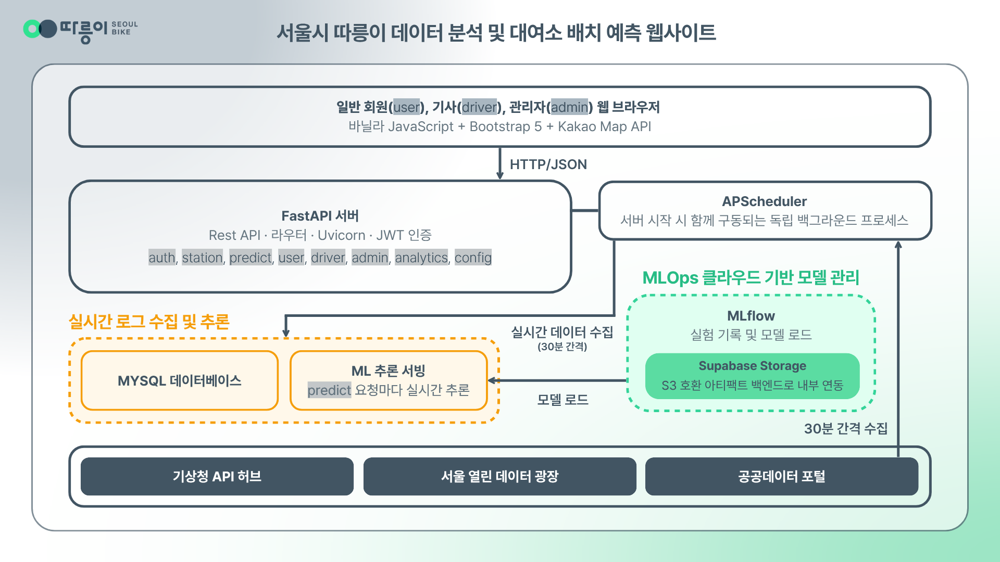

### **시스템 전체 흐름**

> **접속 → API 호출 → 판정/추론 → 화면 표시 → 지시서 발송 → 재배치 완료 → DB 반영**

1. **접속**: 일반 회원(`user`)이 대여소 지도를 조회하거나, 관리자(`admin`)가 관제 지도에 접속
2. **API 호출**: 프론트엔드가 두 갈래로 동시 호출
   - 재고 상태 → `GET /station/*` → 실시간 재고 × 정원 대비 비율 × 이력 기반 시간대별 평균 순감소량 → 고갈 및 과포화 판정
   - 수요 예측 → `GET /predict/stations/{station_id}` → 실시간 피처(기상·인구·인프라) × MLflow 챔피언 모델 → 다음 1시간 대여·반납 건수 추론
3. **화면 표시**: 두 결과 모두 대시보드 및 지도 화면에 표시
4. **지시서 발송**: 관리자(`admin`)가 결과를 참고해 AI 추천 기반 또는 수동으로 재배치 지시서 발송
5. **재배치 완료**: 기사(`driver`)가 지시서 확인 → 카카오내비 경로 안내 → 재배치 완료
6. **DB 반영**: 대여소 재고와 지시서 상태가 데이터베이스에 갱신 (실시간 로그 수집 스케줄러 = 덮어쓰기 X, 대여 및 반납 트랜잭션으로만 갱신)

## 2️⃣  ERD(Entity-Relationship Diagram)


### **주요 핵심 테이블**

| 테이블 | 설명                  | 주요 컬럼 |
| :--- |:--------------------| :--- |
| `account` | 회원(관리자/기사/일반 회원)    | `id`, `login_id`, `role`, `district_id`, `created_at` |
| `station_loc` | 대여소 기본 정보           | `station_id`, `address_1`, `lat`, `lon`, `district` |
| `station_stock` | 실시간 자전거 재고 관리       | `station_id`(FK), `general_bike_cnt`, `sprout_bike_cnt`, `broken_bike_cnt` |
| `rental` | 자전거 대여 및 반납 이력      | `id`, `user_id`(FK), `bike_id`, `rent_station_id`, `return_station_id`, `status` |
| `dispatch` | 재배치 지시 내역           | `id`, `from_station_id`, `to_station_id`, `driver_id`, `status`, `order_type` |
| `report` | 고장 신고 내역            | `id`, `bike_id`, `station_id`(FK), `reported_by`, `status` |
| `demand_prediction_master_2024` | 머신러닝 수요 예측용 마스터 데이터 | `datetime_hr`, `station_id`, `general_rent_cnt`, `temperature`, `flwpop_tot` 등 |

### **주요 테이블 관계**
- `account` **1 : N** `rental` (한 사용자가 여러 번 대여 가능)
- `account` **1 : N** `dispatch` (관리자가 지시하고, 특정 기사가 여러 배치 업무를 수행)
- `station_loc` **1 : 1** `station_stock` (각 대여소는 하나의 실시간 재고 상태를 가짐)
- `station_loc` **1 : N** `rental` (한 대여소에서 여러 번의 대여/반납 발생)
- `station_loc` **1 : N** `dispatch` (한 대여소가 재배치의 출발지 또는 도착지가 됨)

## 3️⃣  API 문서

**`/docs`** 에서 전체 확인 가능

### 주요 엔드포인트

> **인증 및 권한 (`auth.py`)**

| 메서드 | 경로 | 설명 |
| :--- | :--- | :--- |
| POST | `/auth/login` | 역할(일반 회원/기사/관리자)별 로그인, JWT 액세스 토큰 발급 |
| POST | `/auth/signup` | 일반 회원 가입 |
| GET | `/auth/me` | 내 계정 정보 조회 |

> **대여소 및 기본 정보 (`station.py`)**

| 메서드 | 경로 | 설명 |
| :--- | :--- | :--- |
| GET | `/station/public/summary` | 비로그인 공개 요약 (대여소 수, 총 자전거 수, 금일 대여량) |
| GET | `/station/stations` | 대여소 목록 조회 (자치구/재고 상태 필터) |
| GET | `/station/stations/{station_id}` | 대여소 상세 조회 |
| GET | `/station/districts` | 자치구별 목록 및 보유 대수 |
| POST | `/station/rentals` | 자전거 대여 (QR 스캔 또는 수동 입력) |
| PATCH | `/station/rentals/{rental_id}/return` | 자전거 반납, 이동 거리·소요 시간·탄소 절감량 계산 |
| GET | `/station/rentals/active` | 현재 대여 중인 자전거 조회 |
| GET | `/station/rentals/me` | 내 대여/반납 이력 조회 (연/월 필터) |
| GET | `/station/favorites` | 즐겨찾기 대여소 목록 |
| POST | `/station/favorites` | 즐겨찾기 추가 |
| DELETE | `/station/favorites/{station_id}` | 즐겨찾기 삭제 |
| POST | `/station/reports` | 고장 신고 등록 |

> **AI 수요 예측 (`predict.py`)**

| 메서드 | 경로 | 설명                                                              |
| :--- | :--- |:----------------------------------------------------------------|
| GET | `/predict/stations/{station_id}` | 서버 시작 시 MLflow에서 로드한 챔피언 모델로 해당 대여소의 다음 1시간 일반/새싹 대여 및 반납 건수 예측 |

> **일반 회원 전용 (`user.py`)**

| 메서드 | 경로 | 설명 |
| :--- | :--- | :--- |
| PATCH | `/user/login-id` | 아이디 변경 |
| PATCH | `/user/password` | 비밀번호 변경 |
| DELETE | `/user/me` | 회원 탈퇴 (soft delete) |

> **기사 전용 (`driver.py`)**

| 메서드 | 경로 | 설명 |
| :--- | :--- | :--- |
| GET | `/driver/orders` | 내게 배정된 지시서 목록 조회 (상태 필터) |
| PATCH | `/driver/orders/batch` | 같은 대여소의 고장 수거 지시서 일괄 시작/완료 처리 |
| PATCH | `/driver/orders/{order_id}` | 단일 지시서 시작/완료 처리, 완료 시 대여소 재고 갱신 |

> **관리자 대시보드 및 통계 (`admin.py`, `analytics.py`)**

| 메서드 | 경로 | 설명 |
| :--- | :--- | :--- |
| GET | `/admin/drivers` | 기사 목록 조회 (자치구 필터) |
| GET | `/admin/dispatch` | 재배치 지시서 목록 조회 (상태/자치구 필터) |
| POST | `/admin/dispatch` | 재배치 지시서 수동 생성 및 기사 지정 |
| GET | `/admin/reports` | 고장 신고 목록 조회 (연결된 지시서 상태 포함) |
| POST | `/admin/reports/dispatch` | 대여소 단위 미배정 고장 신고를 하나의 수거 지시서로 묶어 발송 |
| GET | `/analytics/hourly-demand` | 실시간 거치대 스냅샷 기반 시간대별 추정 대여량 |
| GET | `/analytics/weekly-demand` | 요일별 추정 대여량 |
| GET | `/analytics/stock-distribution` | 과포화/고갈/부족/적정 대여소 분포 |
| GET | `/analytics/today-summary` | 금일 대여량, 긴급 지시서 수, 과포화 대여소 수 요약 |
| GET | `/analytics/weather-summary` | 헤더 날씨 팝업용 오늘 vs 1시간 전(전일) 날씨 비교 |
| GET | `/analytics/flow` | 대여소 간 이동 흐름 (Sankey 시각화용) |
| GET | `/analytics/weather-index` | 시간대별 자전거 이용 적합도 지수(0~100) |
| GET | `/analytics/feature-importance` | 챔피언 모델의 피처 중요도 (의미 그룹별 집계) |
| GET | `/analytics/model-monitoring` | 전일 실제 대여량 vs 모델 예측치 비교 (야간 배치 결과) |
| GET | `/analytics/carbon-summary` | 누적 탄소 절감량·이동 거리·평균 이용 시간 |
| GET | `/analytics/dispatch-efficiency` | 지시서 평균 처리 시간, 긴급/일반 건수 등 배차 효율 지표 |
| GET | `/analytics/district-ranking` | 자치구별 추정 대여량 랭킹 |

> **기타 (`config.py`)**

| 메서드 | 경로 | 설명 |
| :--- | :--- | :--- |
| GET | `/config/kakao-js-key` | Kakao Map JS SDK 로드용 앱 키 제공 |

---

# 데이터 분석 및 머신러닝

## ️1️⃣  전체 학습 파이프라인

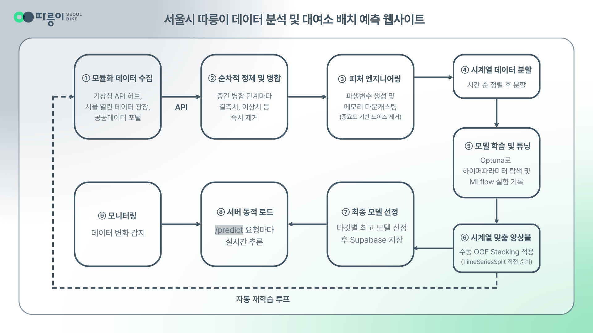

## 2️⃣  데이터 수집 및 전처리

### 데이터 소스

* **따릉이 데이터**
    * [따릉이 대여 및 반납 이력 데이터](https://data.seoul.go.kr/dataList/OA-15182/F/1/datasetView.do)
    * [대여 위치 정보 데이터](https://data.seoul.go.kr/dataList/OA-21235/S/1/datasetView.do)
    * [실시간 따릉이 대여 및 거치 정보 데이터](https://data.seoul.go.kr/dataList/OA-15493/A/1/datasetView.do)
* **환경 및 기상 데이터**
    * [실시간 미세먼지 데이터](https://data.seoul.go.kr/dataList/OA-1200/S/1/datasetView.do)
    * [시간별 미세먼지 데이터](https://data.kma.go.kr/data/climate/selectDustRltmList.do?pgmNo=68)
    * [실시간 기상 데이터(1)](https://www.airkorea.or.kr/web/), [(2)](https://data.kma.go.kr/data/grnd/selectAsosRltmList.do)
    * [시간별 기상 데이터](https://apihub.kma.go.kr/)
* **인구 데이터**
    * [유동 인구 데이터](https://data.seoul.go.kr/dataList/OA-22179/S/1/datasetView.do)
    * [생활 인구 데이터](https://data.seoul.go.kr/dataList/OA-15439/S/1/datasetView.do)
* **인프라 데이터**
    * [공원 위치 데이터](https://data.seoul.go.kr/dataList/OA-394/S/1/datasetView.do)
    * [하천 위치 데이터(1)](https://www.vworld.kr/dtmk/dtmk_ntads_s002.do?dsId=30603), [(2)](https://www.vworld.kr/dtmk/dtmk_ntads_s002.do?dsId=30207)
    * [학교(초, 중, 고) 위치 데이터](https://www.data.go.kr/data/15152021/fileData.do#tab-layer-openapi)
    * [대학교 위치 데이터](https://data.seoul.go.kr/dataList/OA-12974/S/1/datasetView.do)
    * [직장 위치 데이터](https://data.seoul.go.kr/dataList/OA-22243/F/1/datasetView.do)
    * [지하철 역 출입구 위치 데이터](https://data.seoul.go.kr/dataList/OA-21232/S/1/datasetView.do?tab=A)

### 데이터 전처리
- 440만 건의 대여 이력 `chunksize`로 분할 로드 + 데이터 손실 없이 64-bit 자료형을 32-bit로 변환(Downcasting)하여 OOM(Memory Error) 방지
- **개별 파일 및 중간 데이터 병합 단계마다 순차적으로 이상치와 결측치 즉시 제거** ⇒ 데이터 파이프라인의 신뢰성 극대화

### 피처 엔지니어링

> **대여 및 반납 이력 데이터**

| 피처 그룹          | 세부 컬럼 및 설명 |
|:---------------| :--- |
| **대여 및 반납 건수** | `general_rent_cnt`, `sprout_rent_cnt`, `general_rtn_cnt`, `sprout_rtn_cnt` (일반/새싹 자전거 대여·반납량) |
| **이용 시간**      | `total_use_min`, `avg_use_min` (총 사용 시간 및 평균 사용 시간) |
| **성별 이용 성향**   | `rent_male_cnt`, `rent_female_cnt`, `rent_gender_unk_cnt` (대여·반납별 성별 건수) |
| **연령대별 성향**    | `rent_age_10_cnt` ~ `60_cnt`, `rtn_age_10_cnt` ~ `60_cnt` (10대 이하부터 60대 이상까지 세대별 대여·반납 패턴) |

> **인프라 데이터**

| 피처 그룹     | 세부 컬럼 및 설명 |
|:----------| :--- |
| **인프라**   | `subway_cnt_300m`, `biz_cnt_300m`, `edu_cnt_500m`, `park_cnt_500m`, `river_cnt_1km` (반경 내 지하철, 직장, 학교, 공원, 하천 수) |
| **거리 지표** | `dist_subway`, `dist_river` (가장 가까운 지하철역 및 하천까지의 직선 거리) |
| **위치 정보** | `district` (자치구), `lat`, `lon` (위경도 좌표) |

> **환경 데이터**

| 피처 그룹     | 세부 컬럼 및 설명 |
|:----------| :--- |
| **기상 요인** | `temperature` (기온), `precipitation` (강수량), `snowfall` (적설량), `pm10` (미세먼지) |
| **시간 축**  | `datetime_hr` (1시간 단위 기준 시간), `day_of_week` (요일), `is_weekend` (주말 여부), `is_holiday` (공휴일 여부) |

> **인구 데이터**

| 피처 그룹 | 세부 컬럼 및 설명 |
| :--- | :--- |
| **유동인구** | `flwpop_tot` 및 연령대별(`flwpop_10s` ~ `60up`) 시간대별 총 유동인구 |
| **생활인구** | `lvgpop_tot` 및 연령대별(`lvgpop_10s` ~ `60up`) 실제 체류 인구 데이터 |

> **파생 변수**

| 피처명 | 설명 |
| :--- | :--- |
| `subway_last_mile_synergy` | 심야 시간대(23~01시) × 반경 300m 지하철역 수 (막차 귀가 수요 패턴 포착) |
| `pop_spike_ratio` | 최근 24시간 평균 유동인구 대비 현재 시간대 유동인구 비율 (일시적 인구 밀집 반영) |
| `population_dynamic_flux` | 현재 시간대와 1시간 전 생활인구의 차분값 (인구의 유입/유출 동적 흐름 반영) |
| `hour_sin`, `hour_cos` | 시(hour)를 24시간 주기로 sin/cos 변환 (23시→0시 순환 경계의 연속성 확보) |
| `month_sin`, `month_cos` | 월(month)을 12개월 주기로 sin/cos 변환 (계절 순환성 반영) |
| `is_rush_hour` | 출퇴근 러시아워(7~9시, 18~20시) 여부 플래그 |
| `is_bad_weather` | 강수·강설 발생 또는 미세먼지 등급 3(나쁨) 이상 여부 (악천후 통합 플래그) |
| `flow_to_living_ratio` | 유동인구 대비 생활인구 비율 (외부 유입 인구 비중) |
| `infra_density_score` | 반경 내 지하철·직장·학교·공원·하천 수 합산 (대여소 주변 인프라 밀집도) |
| `is_riverside_park` | 반경 내 공원과 하천이 모두 존재하는지 여부 (하천변 공원 입지 플래그) |
| `is_extreme_temp` | 기온 0도 이하 또는 30도 이상 극한 기온 여부 |
| `is_season_change` | 환절기(3·5·9·11월) 여부 |
| `is_long_weekend`, `day_type` | 공휴일-주말 겹침 여부, 평일/주말/공휴일 3단계 구분 |
| `synergy_biz_weekday` | 평일 업무시간(9~18시) × 반경 300m 직장 수 (오피스 통근 수요 포착) |
| `synergy_leisure_weekend` | 주말 여부 × (반경 내 공원+하천 수) (주말 레저 수요 포착) |
| `{target}_lag1h/24h/168h` | 1시간/24시간/168시간(1주일) 전 동일 시점 대여·반납 건수 |
| `{target}_roll3h_mean`, `_rolling_std_3h` | 최근 3시간 대여·반납 건수의 이동평균 및 표준편차 |
| `{target}_roll24h_mean`, `_roll24h_std` | 최근 24시간 대여·반납 건수의 이동평균 및 표준편차 |
| `sprout_rtn_to_rent_ratio_1h`, `general_rtn_to_rent_ratio_1h` | 1시간 전 반납/대여 비율 (자전거 종류별 회전율) |
| `sprout_net_diff_1h`, `general_net_diff_1h` | 1시간 전 반납-대여 순증감 (자전거 종류별 순유입/유출) |

**피처 중요도 기반 노이즈 제거**: 50개가 넘는 방대한 변수 ⇒ 8개 알고리즘의 중요도 정규화 및 평균 통합 ⇒ 중요도 0.01 미만의 하위 변수 = 노이즈로 규정 및 소거

## 3️⃣  모델 선정 과정

### 베이스라인 구축

| 타깃 | 모델 | RMSLE | RMSE | MAE |
|----| :--- | :--- | :--- | :--- |
| `general_rent_cnt` | RandomForest | 0.52536 | 3.167 | 1.823 |
|    | LightGBM | 0.51319 | 3.153 | 1.778 |
|    | XGBoost | 0.51257 | 3.113 | 1.769 |
|    | GradientBoosting | 0.51378 | 3.140 | 1.781 |
|    | Ridge | 0.61654 | 937.071 | 8.401 |
|    | LinearRegression | 0.61654 | 937.094 | 8.401 |
|    | Lasso | 0.62655 | 320.013 | 5.442 |
|    | ElasticNet | 0.60624 | 1320.024 | 10.480 |
| `general_rtn_cnt` | RandomForest | 0.49540 | 2.975 | 1.706 |
|    | LightGBM | 0.48288 | 2.920 | 1.653 |
|    | XGBoost | 0.48658 | 2.952 | 1.674 |
|    | GradientBoosting | 0.48495 | 2.947 | 1.670 |
|    | Ridge | 0.58356 | 349.137 | 4.997 |
|    | LinearRegression | 0.58356 | 349.135 | 4.997 |
|    | Lasso | 0.59631 | 375.183 | 4.661 |
|    | ElasticNet | 0.57904 | 1859.663 | 9.945 |
| `sprout_rent_cnt` | RandomForest | 0.19451 | 0.390 | 0.116 |
|    | LightGBM | 0.19220 | 0.391 | 0.111 |
|    | XGBoost | 0.19181 | 0.387 | 0.110 |
|    | GradientBoosting | 0.19222 | 0.389 | 0.111 |
|    | Ridge | 0.19537 | 0.452 | 0.106 |
|    | LinearRegression | 0.19537 | 0.452 | 0.106 |
|    | Lasso | 0.21164 | 0.443 | 0.123 |
|    | ElasticNet | 0.20849 | 0.438 | 0.122 |
| `sprout_rtn_cnt` | RandomForest | 0.19419 | 0.340 | 0.117 |
|    | LightGBM | 0.19352 | 0.340 | 0.115 |
|    | XGBoost | 0.19402 | 0.338 | 0.115 |
|    | GradientBoosting | 0.19340 | 0.340 | 0.115 |
|    | Ridge | 0.19663 | 0.468 | 0.104 |
|    | LinearRegression | 0.19663 | 0.468 | 0.104 |
|    | Lasso | 0.20660 | 0.389 | 0.125 |
|    | ElasticNet | 0.20453 | 0.386 | 0.124 |

### 하이퍼파라미터 튜닝(Optuna)

| 모델 | 튜닝 전 RMSLE | 튜닝 후 RMSLE | 개선                        |
| :--- | :--- | :--- |:--------------------------|
| XGBoost | 0.51257 | 0.50504 | ▼ 0.00753                 |
| LightGBM | 0.51319 | 0.50778 | ▼ 0.00540                 |
| RandomForest | 0.52536 | 0.51667 | ▼ 0.00869                 |
| Lasso | 0.62655 | 0.59835 | ▼ 0.02820                 |
| Ridge | 0.61654 | 0.61654 | —                         |
| ElasticNet | 0.60624 | 0.61820 | ▲ 0.01196 |

> **탐색 횟수(trials)**
- XGBoost 3개 전략 × 50 `trials`
- LightGBM 4개 전략 × 40~80 `trials`
- Ridge/Lasso/ElasticNet 각 4개 전략 × 30 `trials`

| 모델 | 주요 하이퍼파라미터                                                       | 최적 성능을 낸 튜닝 전략 및 탐색 범위                                                             |
| :--- |:-----------------------------------------------------------------|:-----------------------------------------------------------------------------------|
| **XGBoost** | `n_estimators`, `max_depth`, `learning_rate`                     | `n_estimators`: 200~500, `max_depth`: 8~11, `lr`: 0.005~0.05                       |
| **LightGBM** | `n_estimators`, `max_depth`, `learning_rate`                     | `n_estimators`: 1000~5000, max_depth: 3~6, `lr`: 0.005~0.05                        |
| **RandomForest** | `n_estimators`, `max_depth`, `max_features`, `min_samples_split` | `n_estimators`: 500, `max_depth`: 19, `max_features`: sqrt, `min_samples_split`: 3 |
| **Lasso** | `alpha`                                                          | `alpha`: 0.01~5.0(log)                                                             |
| **Ridge** | `alpha`                                                          | `alpha`: 0.01~1.0(log), `max_iter`: 3000                                           |
| **ElasticNet** | `alpha`, `l1_ratio`                                              | `alpha`: 1e-4~1.0(log), `l1_ratio`: 0.1~0.9, `max_iter`: 3000                      |

### 시계열 맞춤형 커스텀 스태킹 (Manual OOF Stacking)
단순 Voting을 넘어 성능을 한계까지 끌어올리기 위해 Stacking 앙상블 적용

- 일반 `StackingRegressor`를 시계열 분할(`TimeSeriesSplit`)과 결합 시 미래 데이터가 과거에 끼어드는 **데이터 누수(Leakage)** 발생
- `TimeSeriesSplit` 폴드를 직접 순회하며 OOF(Out-Of-Fold) 예측을 수행하고 누수를 완벽히 차단하는 커스텀 클래스(`ManualStackingRegressor`)를 구현
- Base 모델(LGBM, XGB)의 예측값을 바탕으로 `Ridge` 선형 회귀를 최종 추론 모델로 사용

| 타깃 | Voting RMSLE | Stacking RMSLE | 개선 |
| :--- | :--- | :--- | :--- |
| `general_rent_cnt` | 0.50631 | **0.50337** | ▼ 0.00294 |
| `general_rtn_cnt` | 0.48015 | **0.47799** | ▼ 0.00216 |
| `sprout_rent_cnt` | 0.19034 | **0.19027** | ▼ 0.00007 |
| `sprout_rtn_cnt` | **0.19307** | 0.19309 | ▲ 0.00002 (거의 동률) |

## 4️⃣  성능 평가

### 평가지표 및 타깃 변환

| 지표 | 의미 | 특징 |
| :--- | :--- | :--- |
| **RMSLE** | 로그 변환 후 RMSE | 값의 범위가 넓을 때 **상대 오차**를 공평하게 평가 **(주 지표)** |
| **RMSE** | 평균 제곱근 오차 | 실제 대여/반납 대수 단위의 직관적인 절대 오차 크기 |
| **MAE** | 평균 절대 오차 | 이상치에 덜 민감한 평균 오차 |

> **타깃 변환 로직 적용 (`TransformedTargetRegressor`)**
> 학습 시 타깃 변수에 `np.log1p`를 씌워 정규분포화하고, 예측 후 `np.expm1`로 복원 시 음수 값이 나오지 않도록 하한선을 0으로 고정하는 커스텀 역변환 함수(`inverse_log_clip`)를 구현하여 적용

### 최종 모델 및 Test 데이터셋 검증

- `general_rent_cnt` 기준 Baseline(Voting `0.50631`) → 튜닝(XGBoost `0.50504`) → Custom Stacking(`0.50337`)까지 단계적으로 RMSLE 개선 ([3️⃣ 모델 선정 과정](#3️⃣--모델-선정-과정) 참고)

| 타깃 | 최종 모델                 | RMSLE   | RMSE | MAE |
| :--- |:----------------------|:--------| :--- | :--- |
| `general_rent_cnt` | Custom Stacking       | 0.48941 | 2.352 | 1.412 |
| `general_rtn_cnt` | Custom Stacking       | 0.47058 | 2.242 | 1.350 |
| `sprout_rent_cnt` | LightGBM (단일, 튜닝)     | 0.13473 | 0.263 | 0.060 |
| `sprout_rtn_cnt` | RandomForest (단일, 튜닝) | 0.13567 | 0.228 | 0.070 |

## 5️⃣  MLflow 및 Supabase 기반 MLOps 및 모델 관리

### MLflow
머신러닝 실험을 추적·관리하는 도구로, 모델을 학습할 때마다 어떤 파라미터로 학습했고 성능(지표)이 얼마였는지를 자동으로 기록해 최적 조합 탐색

- **Parameters**: 모델 종류, 하이퍼파라미터 (`n_estimators`, `max_depth`, `learning_rate` 등)
- **Metrics**: RMSLE, RMSE, MAE 등 평가지표
- **실험 비교**: 여러 run을 나란히 비교해 최고 성능 조합 선택

### Supabase Storage

- 앙상블 완료 후 생성되는 무거운 모델 파일(`.pkl`)과 중요도 시각화 이미지는 GitHub에 올릴 수 없으므로, AWS S3 호환 프로토콜을 지원하는 **Supabase Storage**에 분리 저장
- 서버 실행 시 또는 학습 파이프라인 구동 시, Supabase에 저장된 최적 파라미터(`best_params.json`)와 모델 아티팩트를 `boto3`로 동적으로 Fetch(다운로드)하여 팀원 간 로컬 환경 불일치와 휴먼 에러 원천 차단

> **기록 및 관리 항목 요약**

| 항목 | 내용 |
| :--- | :--- |
| **Parameters & Metrics** | Optuna 튜닝 결과 및 RMSLE/RMSE/MAE 지표 자동 기록 (MLflow) |
| **Artifacts Storage** | 직렬화된 챔피언 모델(`.pkl`) 및 시각화 리소스 (Supabase S3) |
| **Pipeline Automation** | 클라우드에 저장된 설정값 기반 모델 동적 로드 및 서빙 연동 |

> **팀원별 실험 기록**

| 팀원 | 담당 역할 및 실험 내용 | 주요 발견 및 기여 |
| :--- | :--- | :--- |
| **장수연** | 베이스라인 전체 통합 및 LightGBM 하이퍼파라미터 튜닝(`tuning(수연).ipynb`), Supabase-S3 아키텍처 연동 | LightGBM 트리 구조·학습률 최적화로 단일 모델 최고 성능 달성, 시계열 누수 방지용 OOF Stacking 및 Supabase 동적 파이프라인 구축 |
| **박은비** | XGBoost 하이퍼파라미터 튜닝(`XGBoost_tuning(은비).ipynb`) | XGBoost 최적 파라미터 탐색으로 Baseline 대비 오차 개선 |
| **김세호** | 선형 회귀 계열 모델 하이퍼파라미터 튜닝(`tuning(세호).ipynb`) | 선형 모델의 한계 분석 |
| **권덕윤** | RandomForest 하이퍼파라미터 튜닝(`tuning(덕윤).ipynb`) | 숲의 깊이(`max_depth`) 및 샘플 분할 조건 최적화 |

> **MLflow 실험 화면**

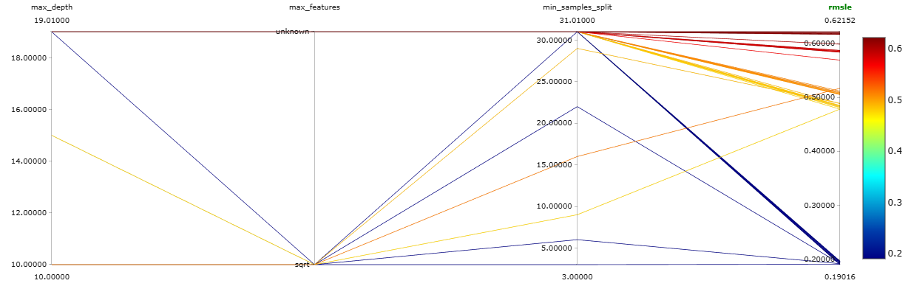

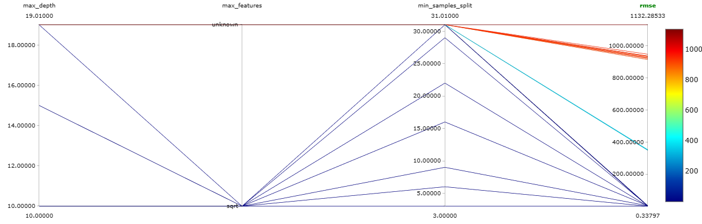

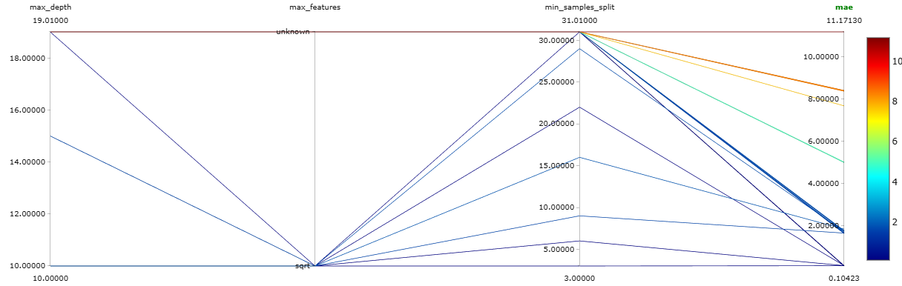


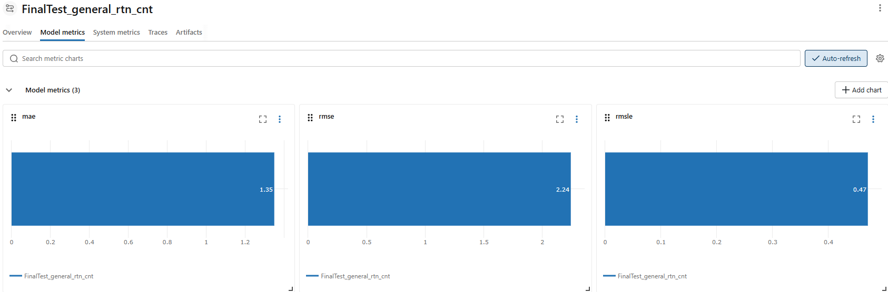


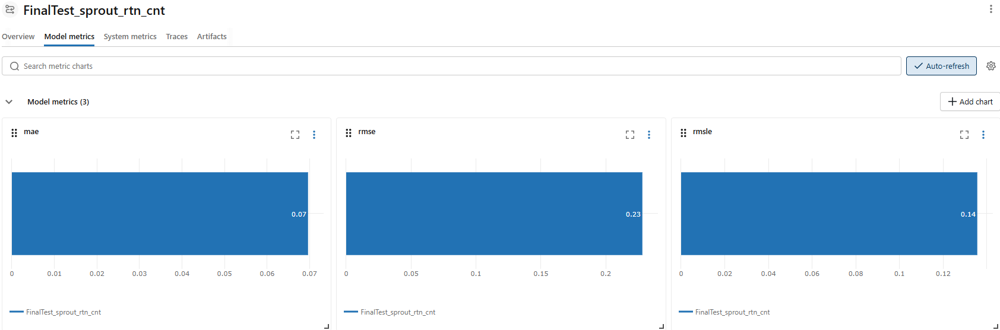

---

## 화면 구현

### 👤 일반 회원
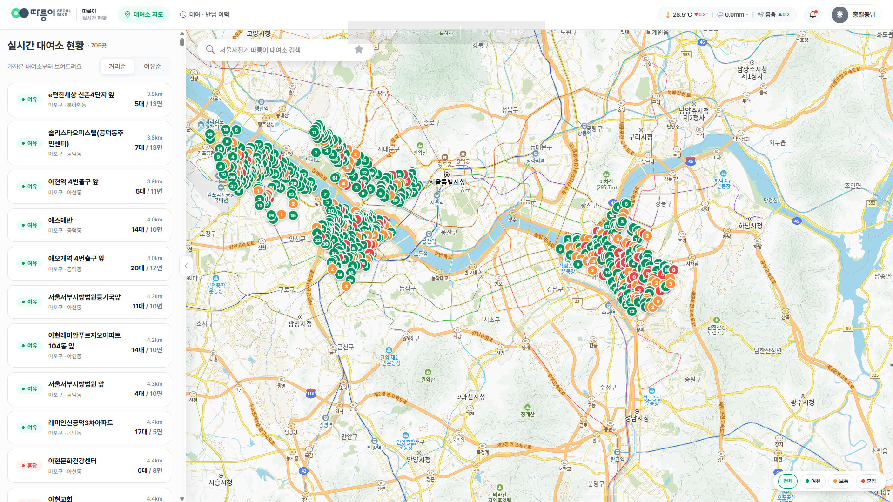
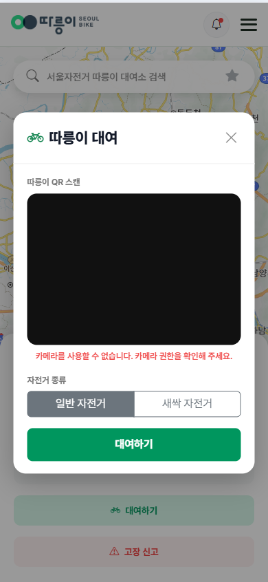

### 🚚 기사
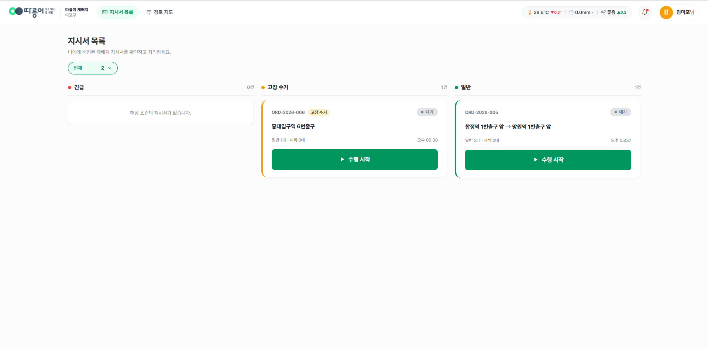
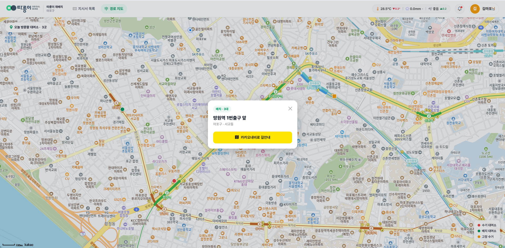

### 🧑‍💻 관리자
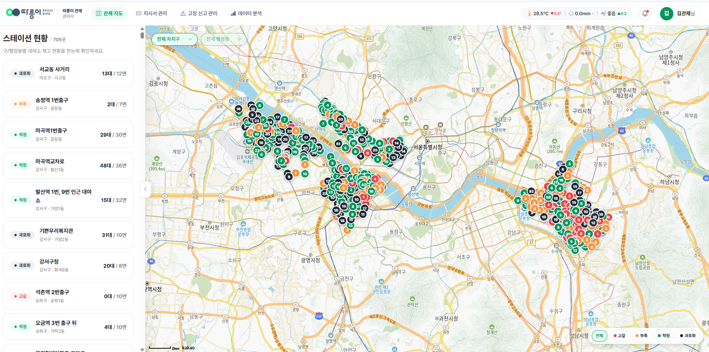
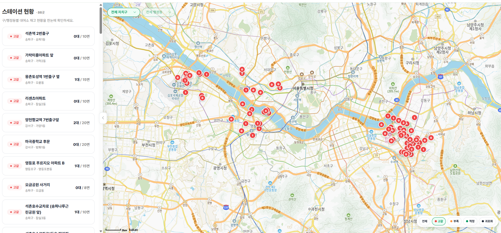
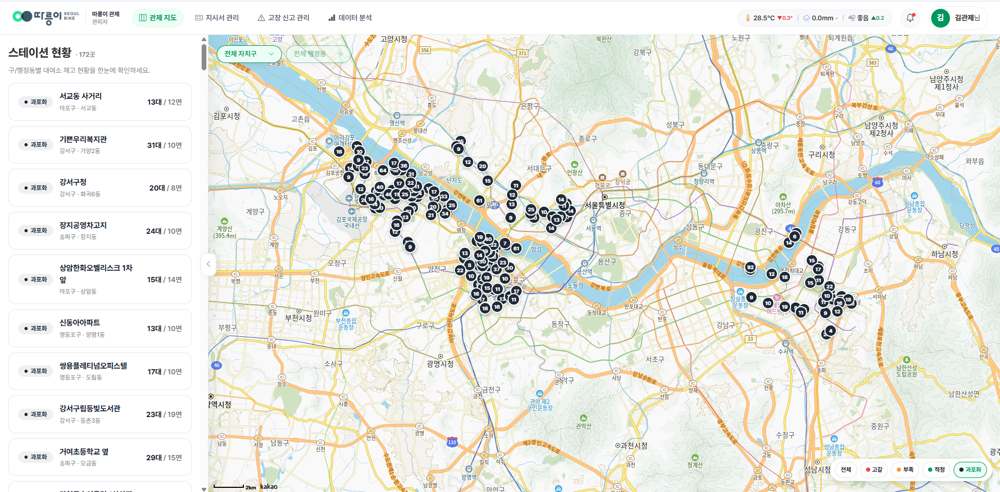

### 플로우 차트
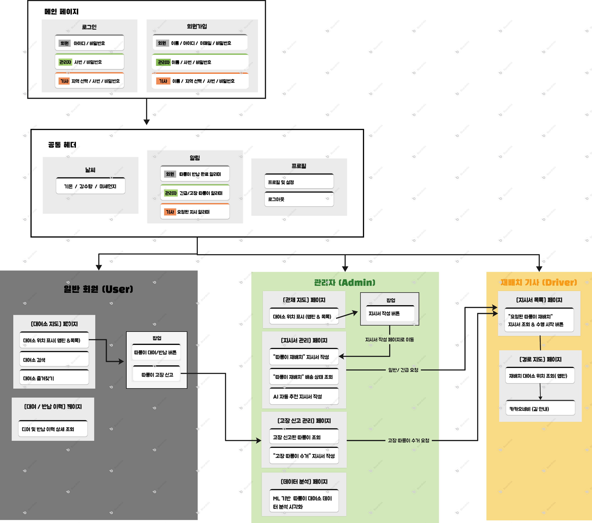
---

## 설치 및 실행

```bash
# 저장소 복제
git clone https://github.com/팀계정/seoul_bike.git
cd seoul_bike

# 가상환경 생성 및 활성화
python -m venv .venv
source .venv/bin/activate      # Windows: .venv\Scripts\activate

# 패키지 설치
pip install -r requirements.txt

# 환경변수 설정 (.env 파일 생성)
# DB_HOST, DB_PORT, DB_USER, DB_PASSWORD, DB_NAME
# JWT_SECRET_KEY, SUPABASE_URL, SUPABASE_KEY 등

# 서버 실행
uvicorn main:app --reload
# → http://127.0.0.1:8000
```

> 머신러닝 최종 모델(`.pkl`)은 서버 가동 시 Supabase S3 클라우드 스토리지에서 자동으로 Fetching 되므로 별도의 모델 파일 로컬 다운로드 불필요

---

## 배포 환경 및 설정

- **서버 환경**: Railway
- **데이터베이스**: MySQL
- **모델 스토리지**: Supabase Storage

---

## 프로젝트 정리

### 기대효과
- 대여소별 시간대별 수요를 사전에 예측해, 실시간 재고만으로 판단하던 재배치 지시를 예측 기반으로 선제적으로 발송 가능
- 관리자가 과포화/고갈 대여소를 자동으로 필터링해 확인할 수 있어, 전체 대여소를 수동으로 순회하며 파악하던 방식보다 소요 시간 단축
- 피처 중요도, 시간대·요일별 수요 추정치, 탄소 절감량 등을 대시보드로 제공해 감에 의존하던 배차를 근거 기반으로 전환
- MLflow + Supabase 기반으로 모델 재학습·교체가 코드 배포 없이 가능해, 데이터가 누적될수록 지속적인 성능 개선 여지 확보

### 개선사항
- 라이브 예측 시점에는 실시간 유동/생활인구 예보 소스가 없어 해당 대여소의 가장 최근 실측값으로 근사 중 → 실시간 인구 예측 API 연동 시 정확도 개선 여지
- 실시간 재고 소스(`rt_bike_status`)가 일반/새싹 자전거를 구분하지 않아 합산된 총량 기준으로만 실시간 판정 → 종류별 실시간 재고 소스 확보 시 새싹 자전거 전용 재배치 판단 가능
- 서빙 시 24시간 이동평균/표준편차를 달력 시간 기준으로 계산해, 학습 노트북의 행(row) 기준 롤링과 미세한 차이 존재 → 두 경로를 동일 로직으로 통일 여지
- `sprout_rent_cnt`/`sprout_rtn_cnt`는 앙상블보다 튜닝된 단일 모델이 더 우수해 챔피언으로 미채택 → 새싹 데이터 특성에 맞는 별도 앙상블 전략 재설계 필요

### 프로젝트 회고

> 장수연(PM)
-

> 박은비(Deputy PM)
-

> 김세호
-

> 권덕윤
-

> 전지혜
-


### 트러블슈팅

- 전체 데이터를 한 번에 병합한 뒤 결측치·이상치를 처리하려다 메모리 초과와 에러 전파 발생 → 개별 파일·중간 병합 단계마다 즉시 정제하는 방식으로 전환 (해결 로직: [데이터 전처리](#데이터-전처리))
- 기본 `StackingRegressor`를 `TimeSeriesSplit`과 결합 시 미래 데이터가 과거 폴드에 섞이는 현상 발견 → `ManualStackingRegressor` 직접 구현으로 차단 (해결 로직: [시계열 맞춤형 커스텀 스태킹](#시계열-맞춤형-커스텀-스태킹-manual-oof-stacking))
- 회귀 모델 특성상 저수요 구간의 예측값이 음수로 도출 → `np.log1p`/`np.expm1` 변환에 0 하한 클램프를 더한 커스텀 역변환 함수 적용 (해결 로직: [평가지표 및 타깃 변환](#평가지표-및-타깃-변환))

---

## 프로젝트 구조

```text
seoul_bike/
├── auth/                       # 인증 및 권한 처리 (deps, jwt 등)
│   ├── __init__.py, deps.py, jwt.py, password.py
├── database/                   # DB 연결 설정 및 ORM 로직
│   ├── __init__.py, db_connection.py, orm.py
├── ml/                         # 머신러닝 학습 파이프라인 (Jupyter Notebook)
│   ├── baseline.ipynb, ensemble.ipynb
├── models/                     # SQLAlchemy DB 테이블 모델
│   ├── __init__.py, models.py
├── routers/                    # FastAPI API 라우터 (엔드포인트)
│   ├── admin.py, analytics.py, auth.py, config.py, driver.py, predict.py, station.py, user.py
├── schema/                     # Pydantic 데이터 검증 스키마 (Request / Response)
│   ├── __init__.py, request.py, response.py
├── serving/                    # ML 모델 로드, 피처 엔지니어링 및 실시간 추론 로직
│   ├── analytics_utils.py, bike_split.py, constant.py, demand_prediction_forecast.py
│   ├── deps.py, district.py, env.py, env_history.py, feature.py, feature_group.py
│   ├── mapping.py, mlflow_model_load.py, mlflow_setup.py, rent_history.py
│   └── scheduler.py, station_lookup.py, station_stock.py, target_encoding.py
├── static/                     # 프론트엔드 정적 리소스 (바닐라 JS)
│   ├── css/                    # 역할별 스타일시트 (admin, driver, user 등)
│   ├── img/                    # 로고, 아이콘 및 메인 비주얼 이미지
│   ├── js/                     # 클라이언트 로직, API 연동 및 지도(Kakao Map) 렌더링
│   │   ├── api.js, kakao-map.js, admin-*.js, driver-*.js, user-*.js 등
│   └── *.html                  # 역할별 대시보드 및 화면 (index, admin, driver, user 등)
├── main.py                     # FastAPI 애플리케이션 진입점 (실행 파일)
├── requirements.txt            # 프로젝트 패키지 의존성 명세
├── .gitignore                  # Git 추적 제외 파일 목록
└── README.md                   # 프로젝트 소개 문서
```

> `.env` (보안 키), `models_pkl/` (대용량 모델 파일), `data/` (원본 데이터) 등은 보안 및 용량 문제로 GitHub에 업로드하지 않고 서버 및 클라우드(Supabase) 환경에서 개별 관리
